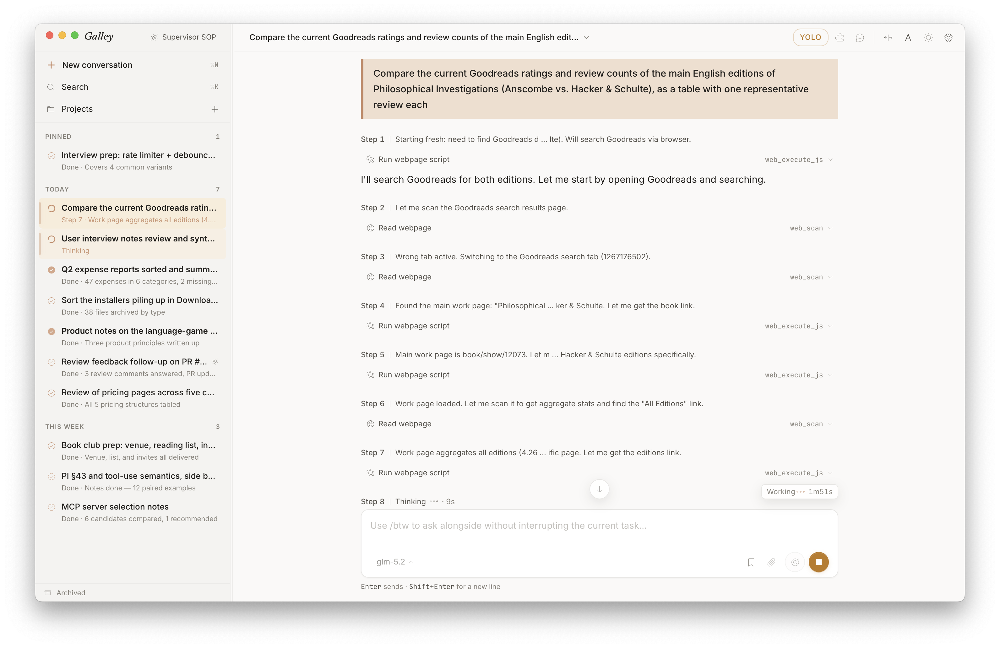
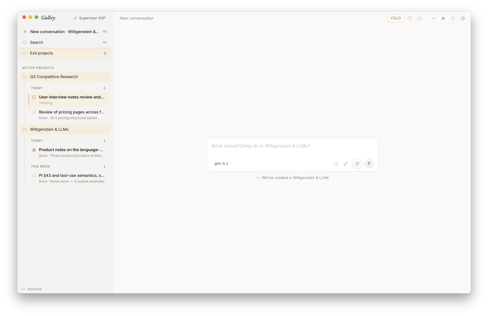
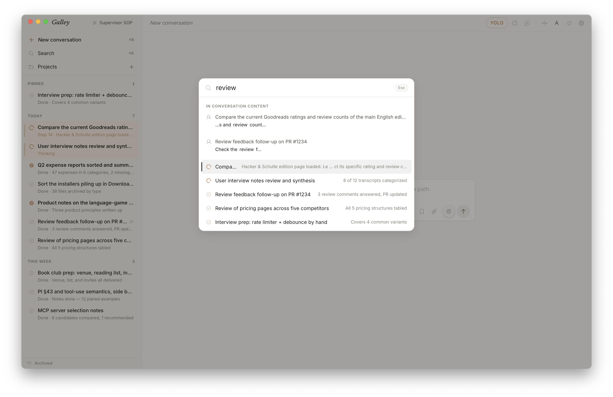
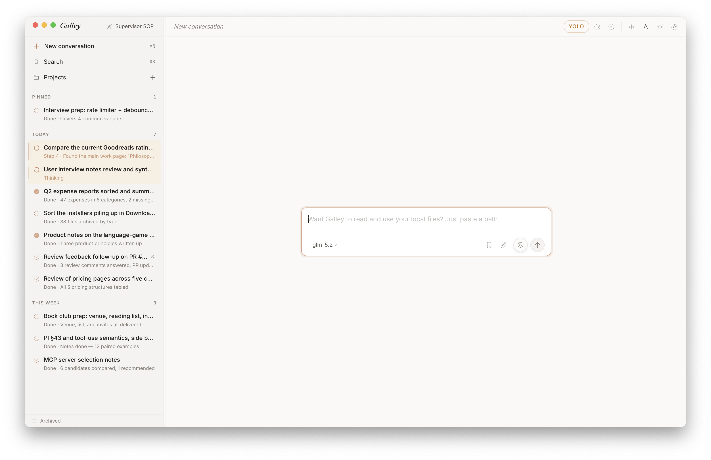
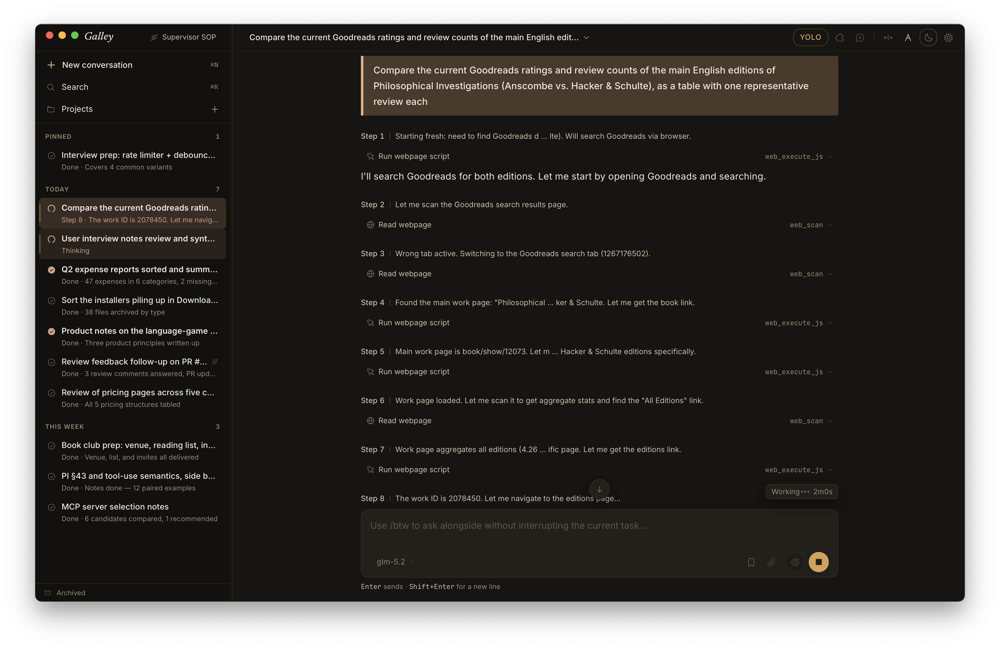

<p align="center">
  
</p>

<h1 align="center">Galley</h1>

<p align="center">
  <strong>Orchestrate multiple AI agents as one team, on your own computer</strong>
  <br/>
  Watch progress, send instructions, and approve from the GUI; a Supervisor Agent orchestrates the whole team in the background — all your data stays on your machine
</p>

<p align="center">
  <a href="https://github.com/wangjc683/galley/releases"><strong>Download</strong></a>
  ·
  <a href="#quick-start">Quick Start</a>
  ·
  <a href="./docs/README.md">Docs</a>
  ·
  <a href="./README.zh-CN.md">中文</a>
</p>

<p align="center">
  <a href="LICENSE"></a>
  <a href="https://github.com/wangjc683/galley/releases"></a>
  <a href="https://github.com/wangjc683/galley/releases"></a>
  <a href="https://github.com/wangjc683/galley/stargazers"></a>
</p>

<p align="center">
  <picture>
    <source media="(prefers-color-scheme: dark)" srcset="docs/screenshots/en/05-hero-dark.png">
    
  </picture>
</p>

---

## Contents

- [What Is Galley](#what-is-galley)
- [Highlights](#highlights)
- [Quick Start](#quick-start)
- [Supervisor / Channels](#supervisor--channels)
- [Architecture](#architecture)
- [Under the Hood](#under-the-hood)
- [Why "Galley"?](#why-galley)
- [Screenshots](#screenshots)
- [Contributing / Building From Source](#contributing--building-from-source)
- [Acknowledgments](#acknowledgments)

---

## What Is Galley

Galley runs a team of AI agents on your own computer. Each agent actually gets things done — driving your browser, terminal, and files, even your phone; multiple sessions advance in parallel, ready to switch, take over, and resume at any time. You watch progress, send instructions, and approve actions in the GUI; a Supervisor Agent orchestrates the same team through the CLI — two roles, one shared state.

| For Humans | For Agents | Ready By Default |
|---|---|---|
| Manage sessions, projects, tool timelines, and approvals in the GUI | The `galley` CLI is a stable public contract for Supervisor Agents | Bundled engine, CPython 3.11, runtime dependencies, and Browser Control assets |

---

## Highlights

### One agent that gets things done

Powered by the bundled engine — a derivative work of [GenericAgent](https://github.com/lsdefine/GenericAgent), shipped inside the installer, ready on first launch.

| | |
|---|---|
| 🖥️ **System-level execution**<br/>Terminal, filesystem, keyboard and mouse, screen vision, all the way to driving a phone over ADB — from looking things up to actually getting them done. | 🌐 **Your real browser**<br/>Connect Chrome / Edge and the agent works in the browser you are already signed into — accounts, memberships, and work consoles are all there. No re-login. |
| 🧬 **Self-evolving skills**<br/>Every new task it solves is crystallized into a reusable skill; the longer you use it, the more capable it gets — and the skill tree lives on your machine. | 💰 **Token efficiency**<br/>The engine actively trims context by information density — less noise, fewer hallucinations, lower cost. Galley sets the default window at 90K tokens, leaving headroom for long tasks. |

### One team you can actually manage

Galley's orchestration layer — a human in the GUI and a Supervisor Agent on the CLI, both first-class operators.

| | |
|---|---|
| 🧭 **Project workspace + multiple sessions**<br/>Point a folder — a code repo or a document directory — at a Project workspace; multiple sessions advance around the same project in parallel, then converge. | 🎯 **Galley Goal**<br/>Hand Galley a long-term goal, set the duration and Subagent budget, and it keeps working in the background until the goal is met or the budget runs out. |
| 🔧 **Tool timeline + approvals**<br/>Every tool call's args, result, and timing are visible inline; risky actions support per-call approval, allowlists, or YOLO mode. | ⚙️ **GUI + CLI dual-native**<br/>You operate in the GUI; a Supervisor Agent goes through the stable `galley` CLI. Both share the same sessions and history, not separate worlds. |
| 💬 **IM Channels**<br/>Connect WeChat / Feishu, keep the conversation going through everyday chat apps, and dispatch Galley Desktop remotely. | 💾 **Persistence + search + background mode**<br/>Close the window without quitting, dispatch remotely while away, then come back and pick up the thread. Past sessions are fully searchable. |

---

## Quick Start

Prepare a usable LLM service first: API Key, Base URL, and model name. Claude / ChatGPT / DeepSeek / Kimi / GLM / MiniMax presets are built in, and any OpenAI-compatible endpoint works.

| 1. Download Galley | 2. Configure a model | 3. Start using it |
|---|---|---|
| Download the macOS / Windows installer from [Releases](https://github.com/wangjc683/galley/releases). | On first launch, enter your API Key, Base URL, and model name. | Click "Test and start using Galley" to enter the main conversation view. |

| Platform | Installer |
|---|---|
| macOS Apple Silicon | filename contains `macOS_aarch64.dmg` |
| macOS Intel | filename contains `macOS_x64.dmg` |
| Windows x64 | filename contains `Windows_x64-setup.exe` |

<details>
<summary>Install notes</summary>

Galley is not code-signed yet. If macOS blocks the first launch, run:

```bash
xattr -dr com.apple.quarantine /Applications/Galley.app
```

On Windows, when SmartScreen says the publisher is unknown, choose "More info" → "Run anyway".

If you already have a [GenericAgent](https://github.com/lsdefine/GenericAgent) environment, choose the GA folder from **Settings → Runtime → Connect external GA**. Once attached, Galley stays strictly read-only and never touches your external GA's code, memory, SOP, or `mykey.py`.

</details>

---

## Supervisor / Channels

In the running GUI, open **Settings → Agent**:

| Button | What it does |
|---|---|
| **Copy SOP** | Copies the short [`galley-supervisor-sop.md`](./docs/integrations/galley-supervisor-sop.md), so your Agent can inspect, continue, start, split, and wait for Galley work; advanced details live in the [Supervisor reference](./docs/integrations/galley-supervisor-reference.md) |
| **Open Agent API docs** | Opens the full command reference, JSON schemas, and exit codes |

You don't need to learn the CLI yourself — tell your Supervisor Agent what you want in natural language and let it operate Galley. The copied SOP is a lightweight hot path; detailed commands and advanced orchestration stay in the reference and Agent API.

Work scales to the right container instead of becoming one giant prompt:

- **Simple requests** — read from or follow a single session;
- **Project / folder work** — bind a workspace with Project Workspace and run sessions in parallel;
- **Long-term goals** — use Goal to set duration and Subagent budget first, then let it run in the background.

You can also connect WeChat / Feishu from **Settings → Channels** to assign work and dispatch Galley Desktop through chat apps.

<details>
<summary>Show CLI examples</summary>

When Galley is running, a Supervisor Agent on the same machine can dispatch tasks through `galley`:

```bash
# What's running right now?
galley status
galley sessions list

# Start a new session to follow up on a PR
galley session new --project=proj_work \
  --supervisor=ga-claude-1 --reason="follow up on PR review" \
  "look at the feedback on #1234"

# Complex goal: use one Project to hold a group of sessions
galley project create "Release readiness review" \
  --supervisor=ga-claude-1 --reason="parallel release-risk review"

galley session new "Read-only check of app identity, data directory, SQLite migrations, and backup risks. Output risks with evidence." \
  --project=proj_from_create --supervisor=ga-claude-1 --reason="check data safety"

galley session new "Read-only check of packaging, release workflow, bundled resources, and version bumps. Output a release blocker checklist." \
  --project=proj_from_create --supervisor=ga-claude-1 --reason="check release packaging"

galley project follow proj_from_create --tail=80 --until-idle --final-show

# Long-term goal: create a proposal first, then start the Goal controller after explicit confirmation
galley goal propose "ship the next patch release" \
  --supervisor=ga-claude-1 --reason="prepare Goal plan and wait for user confirmation"

galley goal run --proposal=<proposal-id> \
  --confirm-token=<internalConfirmToken> \
  --supervisor=ga-claude-1 --reason="user confirmed Goal start"

galley goal status <goal-id>
galley goal deliverable get <goal-id>

# Watch one session's event stream
galley session watch <id>

# Switch model / archive / restart
galley llm set <id> "another model name"
galley session archive <id> --supervisor=ga-claude-1 --reason="done"
```

Every command carries an origin triple (`via=supervisor`, `supervisor=ga-claude-1`, `reason=...`). The GUI timeline annotates supervisor-issued work with "@ga-claude-1 · follow up on PR review · 2 min ago" so the human can see what happened at a glance.

Full command reference, JSON schemas, and exit codes live in [`docs/agent-api.md`](./docs/agent-api.md).

</details>

---

## Architecture

The GUI and the CLI are **peer frontends** — not a GUI wrapping a CLI, but two equals each talking directly to the same **Rust Core**. Core is the single authority, owning session / Project / Goal state, SQLite writes, and runner lifecycle; by default it runs the bundled engine, ready out of the box.

<details>
<summary>Show architecture diagram</summary>

```text
+----------------+                  +----------------+
|   Galley GUI   |---+          +---|   Galley CLI   |
|  Tauri/React   |   |          |   |      Rust      |
+----------------+   |          |   +----------------+
                     v          v
              +------------------------+        localhost only
              |      Galley Core       | <----  unix socket / named pipe
              |          Rust          |        0600 / no token / no TLS
              |  - session lifecycle   |
              |  - projects + goals    |
              |  - SQLite authority    |
              |  - runner + events     |
              +-----------+------------+
                          |
             +------------+------------+
             v                         v
       +------------+             +------------+
       | Runner #1  |     ...     | Runner #N  |        one per session
       |  Python    |             |  Python    |
       +-----+------+             +------+-----+
             |                           |
             +------------+--------------+
                          v
              +------------------------+
              |   Galley-managed GA    |
              | - GenericAgent kernel  |
              | - Galley prompt profile|
              | - bundled CPython 3.11 |
              | - bundled dependencies |
              +------------------------+
```

</details>

**Tech stack:** Tauri v2 + React 19 + TypeScript 5.8 + Tailwind v4 / Rust (Galley Core + Galley CLI) / Python (runner, wraps GenericAgent) / SQLite + FTS5 trigram

More docs:
[Architecture](./docs/architecture.md) ·
[Contributing](./CONTRIBUTING.md) ·
[Docs index](./docs/README.md)

---

## Under the Hood

A few design choices that aren't in the feature list but shape Galley's engineering quality:

- **Peer frontends, not a GUI wrapping a CLI.** The GUI and CLI each connect to the Rust Core independently. If either side exits, sessions and data are unaffected; a new frontend (an IM channel, a future Web client) only needs to speak the same Core protocol — no orchestration logic to rewrite.

- **The Rust Core is the single authority.** The state machines for sessions / Projects / Goals, SQLite writes, and runner lifecycle all converge in one place. Frontends read projections and send intents; they hold no writable state, which removes multi-end state drift at the root.

- **A local-first security model.** Inter-process traffic runs over a Unix socket / named pipe with `0600` permissions, localhost only, no token, no TLS — because the trust boundary is "the same user on the same machine." Not forcing network-style auth onto a local tool is a deliberate subtraction.

- **The Agent API is a frozen public contract.** CLI output carries a `schemaVersion`, frozen within 0.2.x; every command carries an origin triple (`via` / `supervisor` / `reason`), and the GUI timeline reconstructs who changed a session, why, and when. A Supervisor can program against it with confidence.

- **Discipline at the dual-runtime boundary.** The default is the bundled engine (CPython 3.11 and dependencies included, ready out of the box); when attaching an external GenericAgent, Galley stays strictly read-only — it never touches the external GA's code, memory, SOP, or `mykey.py`, so your existing environment stays clean.

- **A persistence layer built to evolve.** SQLite is the authoritative store, with ordered migrations that make upgrades replayable; past sessions are indexed with FTS5 trigram so even Chinese substrings are searchable, staying resident in the background and instantly searchable when you return.

---

## Why "Galley"?

A ship's galley is both kitchen and workbench. Everyone comes there for a different reason, but **the table is the same table**.

Galley is that shared table: humans drive work from the GUI, while Supervisor Agents manage the team through the CLI. Both share the same sessions, history, and decision log instead of living in separate tabs.

> *Galley started as a workbench for [GenericAgent](https://github.com/lsdefine/GenericAgent). The first two letters of our name are a quiet bow to where we came from.*

## Screenshots

| | |
|---|---|
| <br/><sub>Project view — sessions advancing around one project</sub> | <br/><sub>⌘K — every past conversation is full-text searchable</sub> |
| <br/><sub>The workspace at rest — background work keeps moving</sub> | <br/><sub>Dark theme — the same desk at night</sub> |

## Contributing / Building From Source

```bash
git clone https://github.com/wangjc683/galley
cd galley

# Python runner tests
python3 -m venv .venv
.venv/bin/pip install -e ".[dev]"
.venv/bin/python -m pytest          # unit tests
GA_PATH=/path/to/GenericAgent BRIDGE_PYTHON=/path/to/python .venv/bin/python -m pytest -m e2e

# Desktop app development / build
cd gui
pnpm install
pnpm tauri dev                       # macOS / Windows desktop dev mode
pnpm tauri build                     # produces .app / .dmg / .exe

# Galley CLI standalone build
cd ../core
cargo build --release -p galley-cli  # produces target/release/galley
```

See [docs/release-update-sop.md](./docs/release-update-sop.md) for the CI release flow ([background and troubleshooting](./docs/release-workflow.md)) and [docs/windows-build-checklist.md](./docs/windows-build-checklist.md) for manual Windows builds.

## Acknowledgments

Galley's engine is a derivative work of [**lsdefine/GenericAgent**](https://github.com/lsdefine/GenericAgent) — a minimal, self-evolving agent framework grown from ~3K lines of seed code. Galley would not exist without that clean foundation.

Paper: [GenericAgent: A Token-Efficient Self-Evolving LLM Agent via Contextual Information Density Maximization (arXiv:2604.17091)](https://arxiv.org/abs/2604.17091)

## License

[MIT](./LICENSE)
