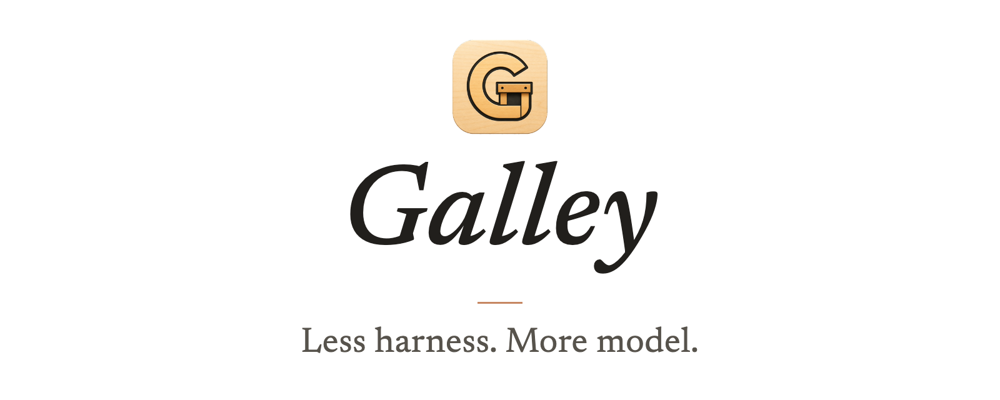
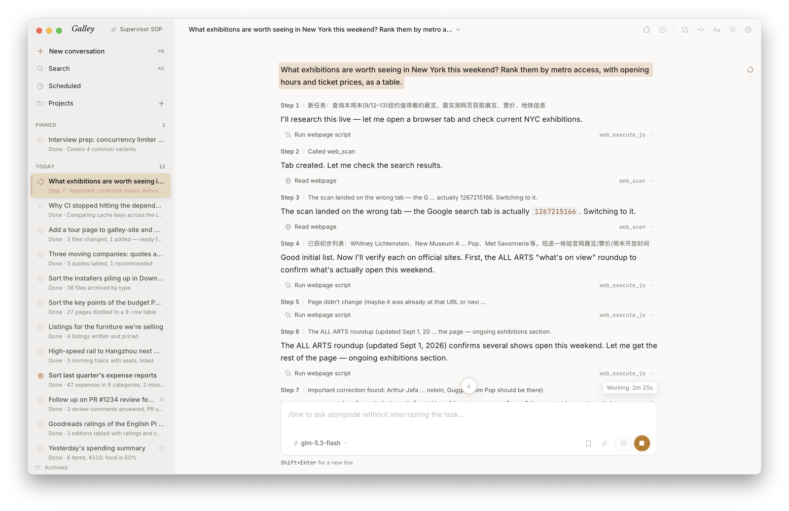
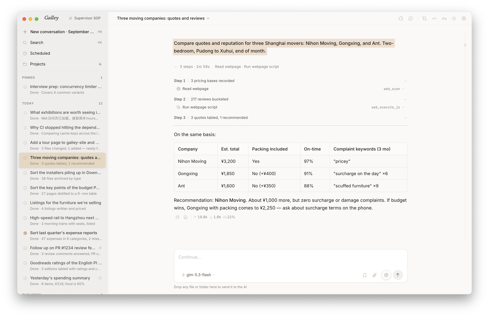
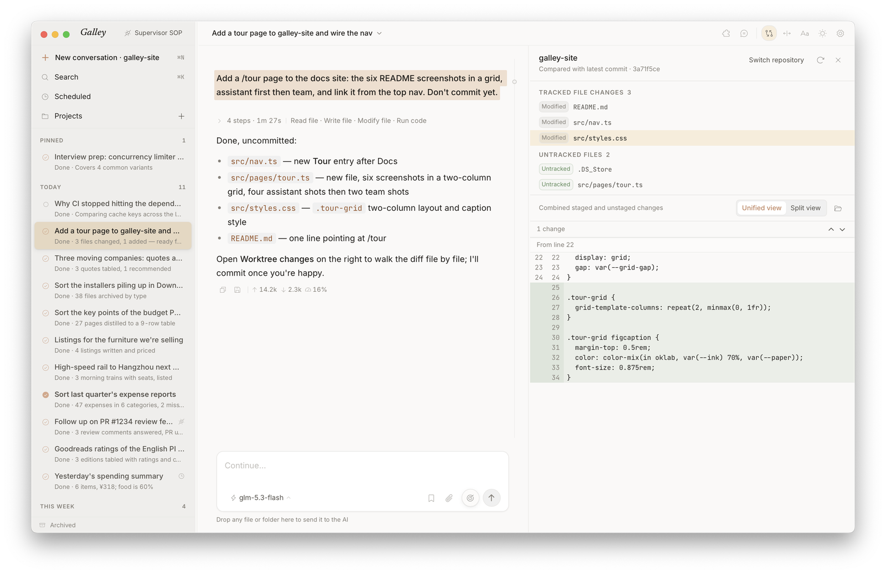
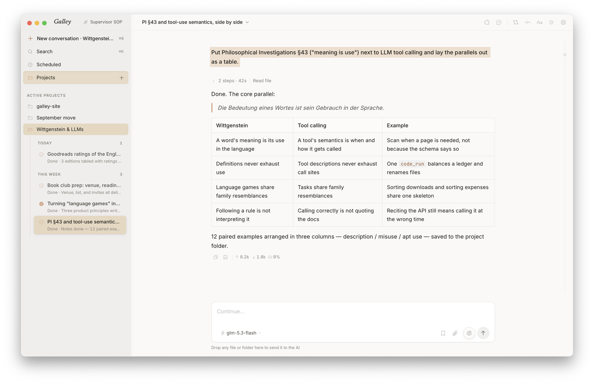
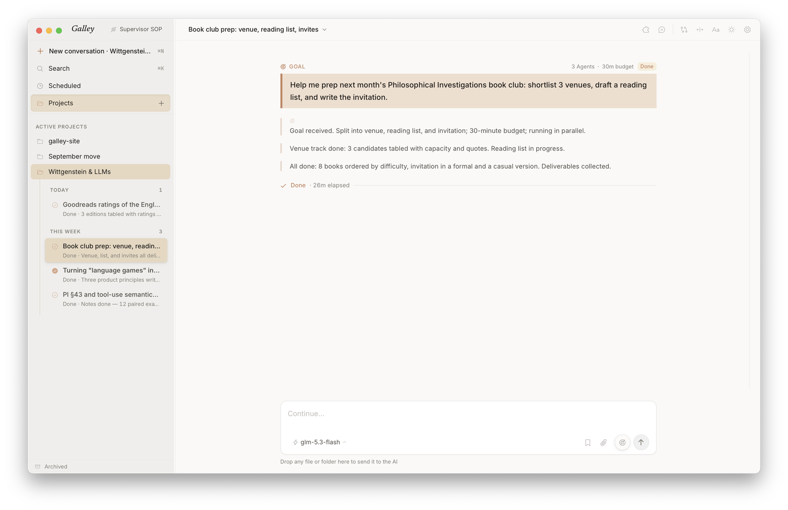
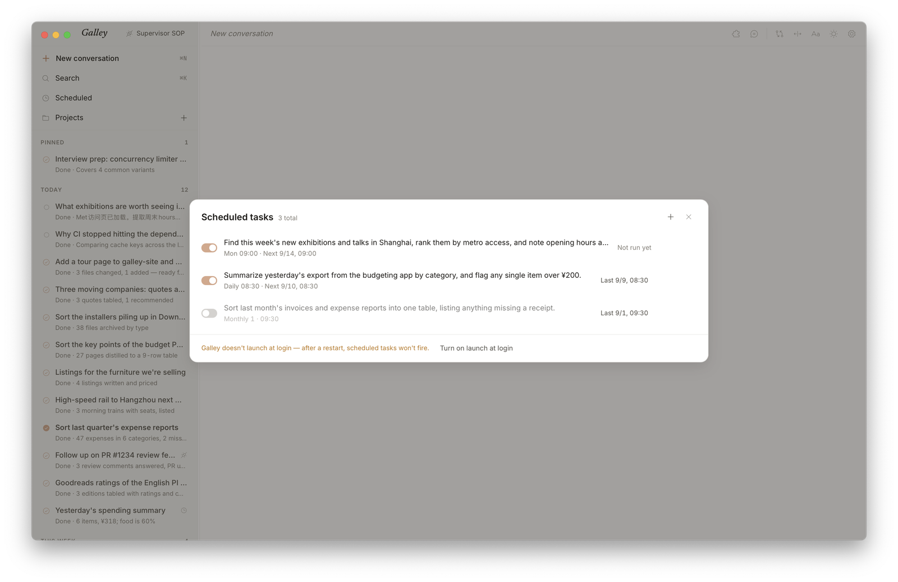
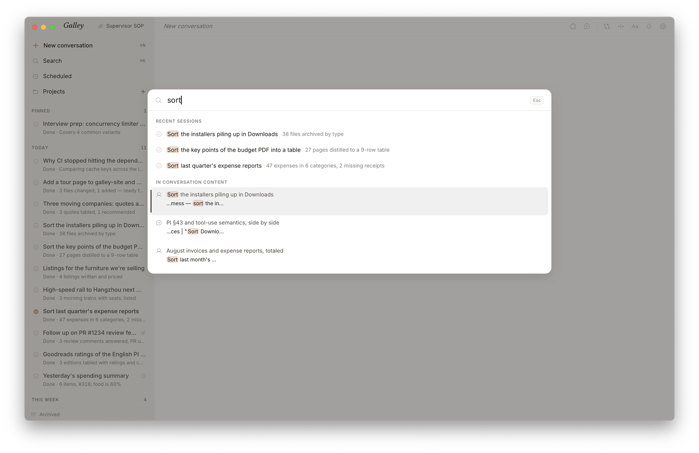
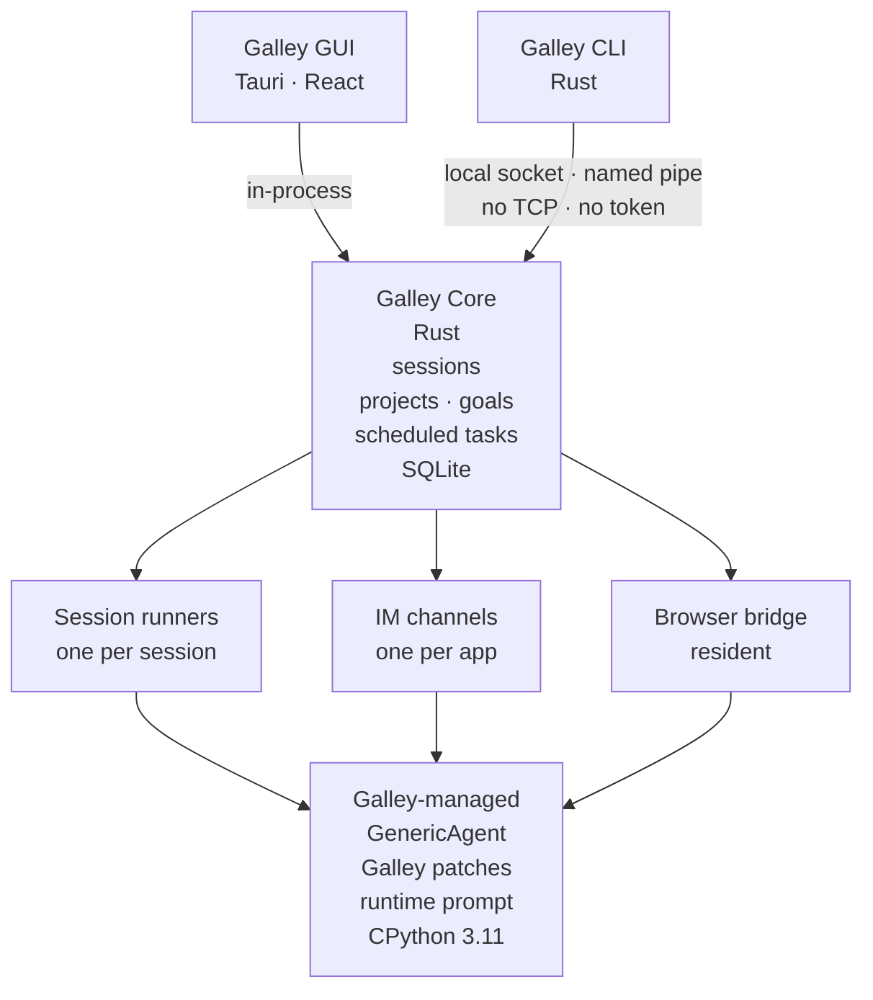
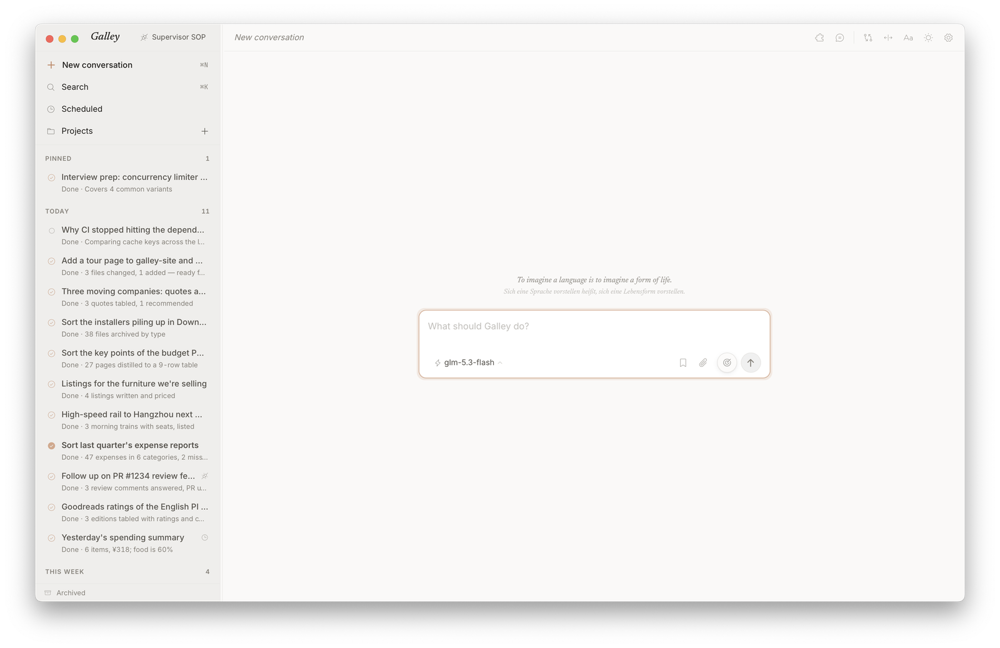

<p align="center">
  <picture>
    <source media="(prefers-color-scheme: dark)" srcset="docs/assets/readme-banner-dark.png">
    
  </picture>
</p>

<p align="center">
  A lightweight, general-purpose assistant that lives on your computer: a thin harness that leans on the model itself, built to get better with every model release.
</p>

<p align="center">
  <a href="https://github.com/wangjc683/galley/releases"><strong>Download</strong></a>
  ·
  <a href="#quick-start">Quick Start</a>
  ·
  <a href="#a-quick-tour">Tour</a>
  ·
  <a href="./docs/README.md">Docs</a>
  ·
  <a href="./README.zh-CN.md">中文</a>
</p>

<p align="center">
  <a href="https://github.com/wangjc683/galley/releases"></a>
  <a href="https://github.com/wangjc683/galley/releases"></a>
  <a href="LICENSE"></a>
</p>

<p align="center">
  <picture>
    <source media="(prefers-color-scheme: dark)" srcset="docs/screenshots/en/hero-dark.png">
    
  </picture>
  <br/>
  <sub>Follows your system appearance — light or dark.</sub>
</p>

## What Is Galley

Galley is a personal AI assistant that runs on your own computer and actually gets things done — driving your browser, terminal, and files, even your phone. Its harness is deliberately thin: the engine keeps the tool set minimal and the context dense, so the model's own ability does the work, and every model upgrade lands as a Galley upgrade — no waiting for us to catch up.

When one assistant isn't enough, Galley becomes a team. Multiple sessions advance in parallel, ready to switch, take over, and resume at any time. You watch progress and send instructions in the GUI; a Supervisor Agent orchestrates the same team through the CLI — two roles, one shared state, all of it on your machine.

## Highlights

### One agent that gets things done

Powered by the bundled engine — a derivative work of [GenericAgent](https://github.com/lsdefine/GenericAgent), shipped inside the installer, ready on first launch.

- 🖥️ **System-level execution** — terminal, files, keyboard and mouse, screen vision, even a phone over ADB: from looking things up to getting them done.
- 🌐 **Your real browser** — load the bundled extension into Chrome or Edge once, and the agent works in the browser you're already signed into. No re-login.
- 🧬 **Self-evolving skills** — every new task it solves becomes a reusable skill; the skill tree grows on your machine.
- 💰 **Token efficiency, measured** — dense context instead of long: 100% on Lifelong AgentBench with 3–6× fewer input tokens than leading agents ([paper](https://arxiv.org/abs/2604.17091)). The default window is 90K.
- 🔌 **Any model, including local ones** — presets from Anthropic and OpenAI to DeepSeek, Kimi, and GLM, ChatGPT sign-in, any compatible endpoint, Ollama with no key; reasoning effort per conversation.
- 📖 **Reading panel** — files the agent writes open beside the conversation: Markdown, code, images, CSV as a table. Add files or images from the composer; review a Git repository's changes read-only, unified or split.

### One team you can actually manage

Galley's orchestration layer. You operate in the GUI; a Supervisor Agent goes through the stable `galley` CLI. Both are first-class operators sharing the same sessions and history — not separate worlds.

- 🧭 **Projects + parallel sessions** — point a Project at a folder, a code repo or a document directory, and let several sessions advance around it in parallel.
- 🎯 **Galley Goal** — give a conversation a goal and it keeps going on its own until the model says it's done, the time ceiling runs out, or you stop it.
- 🔧 **Transparent runs** — watch the reasoning stream in; every step opens to its full arguments and result, and a finished run folds into one line.
- ⏰ **Scheduled tasks** — a prompt that runs daily, weekly, or monthly in a new session, its result waiting in the sidebar. Galley needs to be running and can launch at login.
- 💬 **IM Channels** — WeChat, Feishu, Telegram, or Discord: the same assistant from your phone, handing longer jobs to desktop sessions.
- 💾 **Background + search** — close the window and Galley stays in the menu bar / tray, notifies you when work finishes, and ⌘K (Ctrl+K on Windows) searches every past conversation.

## A Quick Tour

<table>
  <tr>
    <td width="50%" valign="top"><br/><sub>Tool timeline — every call's arguments, result, and timing, inline</sub></td>
    <td width="50%" valign="top"><br/><sub>Reading panel — review worktree changes beside the conversation</sub></td>
  </tr>
  <tr>
    <td width="50%" valign="top"><br/><sub>Project view — sessions advancing around one project</sub></td>
    <td width="50%" valign="top"><br/><sub>Goal — a long-running objective with chapter markers</sub></td>
  </tr>
  <tr>
    <td width="50%" valign="top"><br/><sub>Scheduled tasks — a prompt that runs itself every morning</sub></td>
    <td width="50%" valign="top"><br/><sub>⌘K — every past conversation, straight to the matching line</sub></td>
  </tr>
</table>

## Quick Start

Decide how you'll connect a model first. Presets for ChatGPT / Codex, OpenAI, Anthropic, DeepSeek, Kimi for Coding, MiniMax, OpenRouter, SiliconFlow, Xiaomi MiMo, and Zhipu GLM are built in, with the endpoint prefilled: ChatGPT / Codex signs in with your ChatGPT account, the others take an API Key. For any other OpenAI- or Anthropic-compatible endpoint, pick Custom and enter its URL; a local server such as Ollama needs no key.

1. **Download Galley** — the macOS / Windows installer from [Releases](https://github.com/wangjc683/galley/releases).
2. **Configure a model** — on first launch, pick a provider and paste your API Key (or sign in with ChatGPT); the connection is tested automatically.
3. **Start using it** — click "Start using Galley" to enter the main conversation view (a ChatGPT sign-in takes you straight there).

| Platform | Installer |
|---|---|
| macOS Apple Silicon | filename contains `macOS_aarch64.dmg` |
| macOS Intel | filename contains `macOS_x64.dmg` |
| Windows x64 | filename contains `Windows_x64-setup.exe` |

<details>
<summary>Install notes</summary>

Galley is not code-signed yet. If macOS blocks the first launch, run:

```bash
xattr -dr com.apple.quarantine /Applications/Galley.app
```

On Windows, when SmartScreen says the publisher is unknown, choose "More info" → "Run anyway".

If you already have a [GenericAgent](https://github.com/lsdefine/GenericAgent) environment, choose the GA folder from **Settings → Runtime → More → Connect external GA**. Once attached, Galley stays strictly read-only and never touches your external GA's code, memory, SOP, or `mykey.py`. Browser Control and Channels run on the bundled engine only, and the providers under **Settings → Models** serve the bundled engine; an external GA keeps using its own `mykey.py`.

</details>

## Supervisor / Channels

In the running GUI, open **Settings → Agent**:

| Button | What it does |
|---|---|
| **Copy SOP** | Copies the short [`galley-supervisor-sop.md`](./docs/integrations/galley-supervisor-sop.md), so your Agent can inspect, continue, start, split, and wait for Galley work; advanced details live in the [Supervisor reference](./docs/integrations/galley-supervisor-reference.md) |
| **Open Agent API docs** | Under **Advanced options**: opens the full command reference, JSON schemas, and exit codes |
| **Install galley command** | Under **Advanced options** (macOS): puts `galley` on your PATH for you and your scripts; the SOP doesn't need it |

You don't need to learn the CLI yourself — tell your Supervisor Agent what you want in natural language and let it operate Galley. The copied SOP is a lightweight hot path; detailed commands and advanced orchestration stay in the reference and Agent API. Claude Code users can install the same SOP as a skill: [galley-supervisor](./.claude/skills/galley-supervisor/README.md) (a Codex copy lives under `.agents/skills/`).

Work scales to the right container instead of becoming one giant prompt:

- **Simple requests** — read from or follow a single session;
- **Project / folder work** — bind a workspace with Project Workspace and run sessions in parallel;
- **Long-running goals** — when you ask for one, start a Goal on a session with a time ceiling and let it keep going until it's done.

You can also connect WeChat / Feishu / Telegram / Discord from **Settings → Channels** and reach the same assistant from your phone; it hands longer jobs to desktop sessions.

<details>
<summary>Show CLI examples</summary>

When Galley is running, a Supervisor Agent on the same machine can dispatch tasks through `galley`:

```bash
# What's running right now? (`live.busy` on each row is the truthful signal;
# `live.askPending` means the session is waiting on a question)
galley status
galley sessions list

# Start a new session to follow up on a PR
galley session new --project=proj_work \
  --supervisor=ga-claude-1 --reason="follow up on PR review" \
  "look at the feedback on #1234"

# Complex task: use one Project to hold a group of sessions
galley project create "Release readiness review" \
  --supervisor=ga-claude-1 --reason="parallel release-risk review"

galley session new "Read-only check of app identity, data directory, SQLite migrations, and backup risks. Output risks with evidence." \
  --project=<project-id> --supervisor=ga-claude-1 --reason="check data safety"

galley session new "Read-only check of packaging, release workflow, bundled resources, and version bumps. Output a release blocker checklist." \
  --project=<project-id> --supervisor=ga-claude-1 --reason="check release packaging"

galley project follow <project-id> --tail=80 --until-idle --final-show

# Long-running goal (only when the user asks for one): the session keeps going
# until the model declares it done, the time ceiling hits, or you stop it
galley goal start <session-id> "ship the next patch release" --budget-minutes=60 \
  --supervisor=ga-claude-1 --reason="user asked Galley to keep going until done"

galley goal status <goal-id>
galley goal extend <goal-id> --minutes=30
galley goal stop <goal-id>

# Follow one session, or wait until its run ends
galley session follow <id>
galley session wait <id> --until-idle --timeout=600

# Switch model / archive / restore
galley llm set <id> "another model name"
galley session archive <id> --supervisor=ga-claude-1 --reason="done"
galley session restore <id>
```

Write commands take `--supervisor` and `--reason`; with `--supervisor` set, the work is recorded as `via=supervisor` (otherwise `via=cli`). Sessions and messages a Supervisor creates carry a Supervisor mark in the sidebar and the timeline, so the human can see at a glance what came from an agent.

Full command reference, JSON schemas, and exit codes live in the [Agent API docs](./docs/agent-api/README.md).

</details>

## Architecture

The GUI and the CLI are **peer frontends** — not a GUI wrapping a CLI, but two equals each talking directly to the same **Rust Core**: the GUI from inside the app, the CLI over a local socket. Core is the single authority, owning session / Project / Goal state, the Goal loop, scheduled tasks, SQLite writes, and every Python process Galley runs; by default those run on the bundled engine, ready out of the box.


```mermaid
flowchart TB
  GUI["Galley GUI<br/>Tauri · React"] -- in-process --> Core
  CLI["Galley CLI<br/>Rust"] -- "local socket · named pipe<br/>no TCP · no token" --> Core
  Core["Galley Core<br/>Rust<br/>sessions<br/>projects · goals<br/>scheduled tasks<br/>SQLite"]
  Core --> R["Session runners<br/>one per session"]
  Core --> IM["IM channels<br/>one per app"]
  Core --> BB["Browser bridge<br/>resident"]
  R & IM & BB --> GA["Galley-managed<br/>GenericAgent<br/>Galley patches<br/>runtime prompt<br/>CPython 3.11"]
```

All three kinds of process run Python. When you attach an external GA, session runners use it instead, and IM channels and the browser bridge stay off.

**Tech stack:** Tauri v2 + React 19 + TypeScript 5.8 + Tailwind v4 / Rust (Galley Core + Galley CLI) / Python (runner, wraps GenericAgent) / SQLite + FTS5 trigram

More docs:
[Architecture](./docs/architecture.md) ·
[Contributing](./CONTRIBUTING.md) ·
[Docs index](./docs/README.md)

## Under the Hood

A few design choices that aren't in the feature list but shape Galley's engineering quality:

<details>
<summary>Show the six design choices</summary>

- **Peer frontends, not a GUI wrapping a CLI.** The GUI and CLI each reach the Rust Core on their own, so neither depends on the other. Closing the window leaves Core, its sessions, and the CLI running in the background. Chat apps didn't need a protocol of their own either: inside each IM channel, the assistant drives Galley through the same CLI a Supervisor uses.

- **The Rust Core is the single authority.** The state machines for sessions / Projects / Goals, the Goal loop, scheduled tasks, SQLite writes, and every child process converge in one place. Frontends read projections and send intents; they hold no writable state, which removes multi-end state drift at the root.

- **A local-first security model.** Inter-process traffic runs over a Unix socket (`0600`) or a Windows named pipe, localhost only, no token, no TLS — because the trust boundary is "the same user on the same machine." Not forcing network-style auth onto a local tool is a deliberate subtraction.

- **The Agent API is a versioned public contract.** CLI output carries a `schemaVersion`; within a version, changes are additive only, and a breaking change takes a new version — `2` arrived with Goal v2 in v0.5.0, while every command that didn't change still answers `1`. Write commands record who asked and why (`via` / `supervisor` / `reason`). A Supervisor can program against it with confidence.

- **Discipline at the dual-runtime boundary.** The default is the bundled engine (CPython 3.11 and dependencies included, ready out of the box); when attaching an external GenericAgent, Galley stays strictly read-only — it never touches the external GA's code, memory, SOP, or `mykey.py`, so your existing environment stays clean.

- **A persistence layer built to evolve.** SQLite is the authoritative store; before applying ordered migrations, an upgrade backs up the whole data directory. Past sessions are indexed with FTS5 trigram so even Chinese substrings are searchable, staying resident in the background and instantly searchable when you return.

</details>

## Why "Galley"?

A ship's galley is both kitchen and workbench. Everyone comes there for a different reason, but **the table is the same table**.

Galley is that shared table: humans drive work from the GUI, while Supervisor Agents manage the team through the CLI. Both share the same sessions, history, and decision log instead of living in separate tabs.

> *Galley started as a workbench for [GenericAgent](https://github.com/lsdefine/GenericAgent). The first two letters of our name are a quiet bow to where we came from.*

<p align="center">
  
  <br/>
  <sub>Every new conversation opens on an epigraph — this one from the <em>Investigations</em>.</sub>
</p>

## Contributing / Building From Source

```bash
git clone https://github.com/wangjc683/galley
cd galley
pnpm --dir gui install
./scripts/bundle-python.sh mac-arm64   # or mac-x64 / win-x64: stages the bundled Python once
pnpm --dir gui tauri dev               # desktop dev mode
```

Prerequisites, the checks CI runs, runner tests, installer and standalone CLI builds are in [CONTRIBUTING.md](./CONTRIBUTING.md).

## Acknowledgments

Galley's engine is a derivative work of [**lsdefine/GenericAgent**](https://github.com/lsdefine/GenericAgent) — a minimal, self-evolving agent framework grown from ~3K lines of seed code. Galley would not exist without that clean foundation.

Paper: [GenericAgent: A Token-Efficient Self-Evolving LLM Agent via Contextual Information Density Maximization (arXiv:2604.17091)](https://arxiv.org/abs/2604.17091)

## License

[MIT](./LICENSE)
