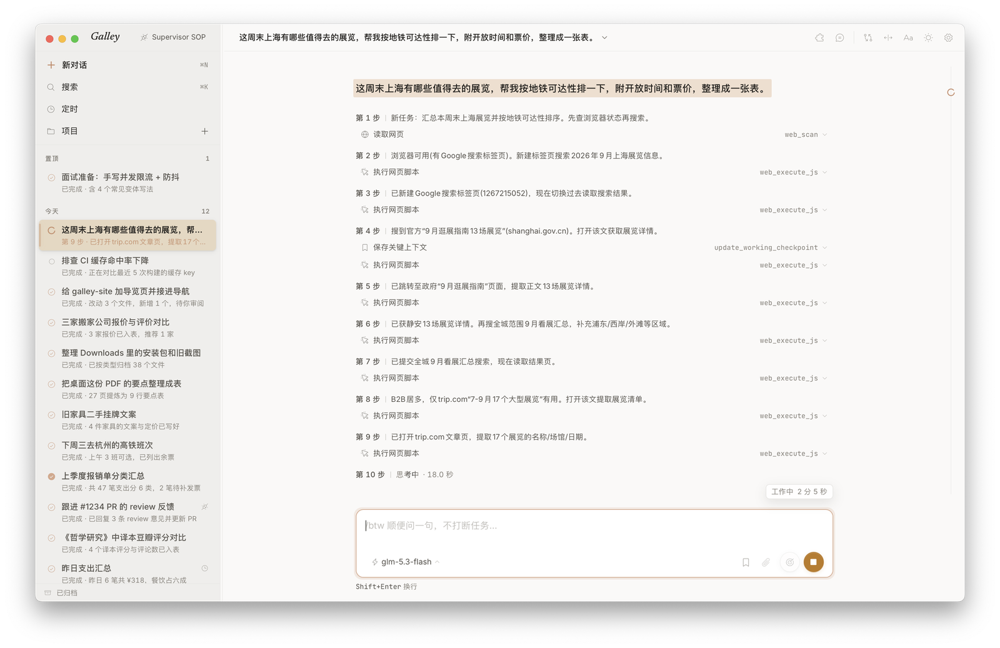
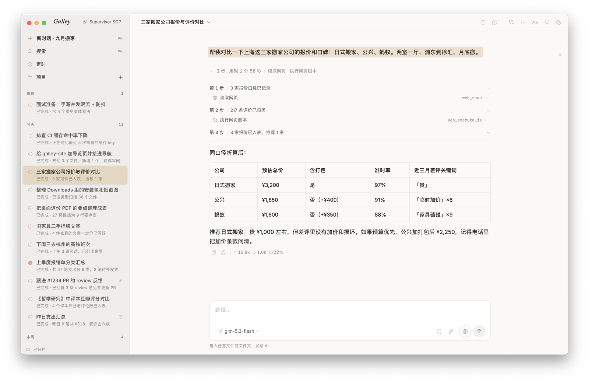
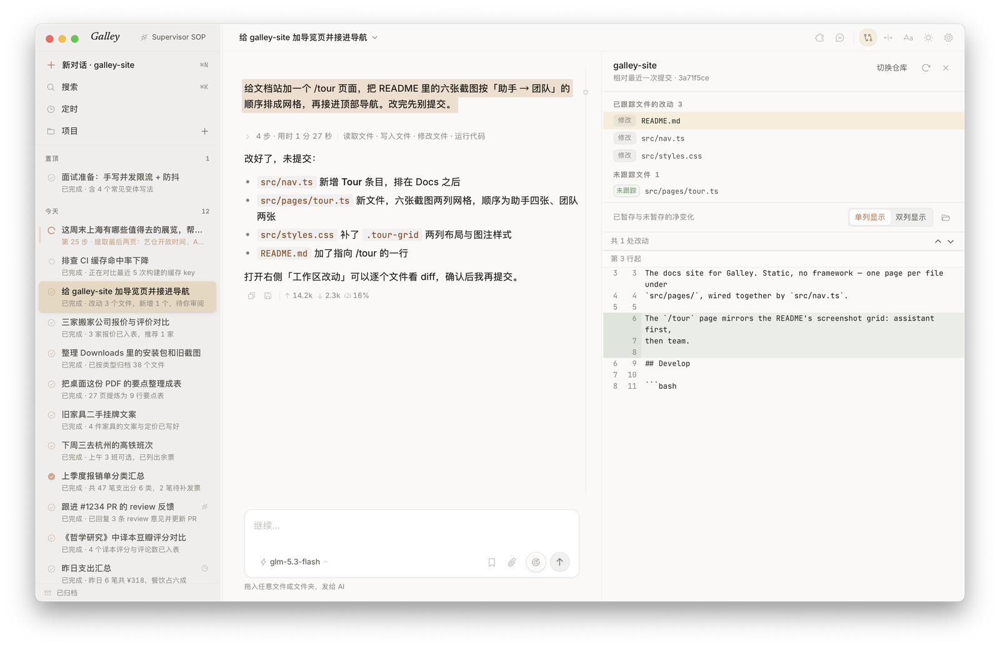
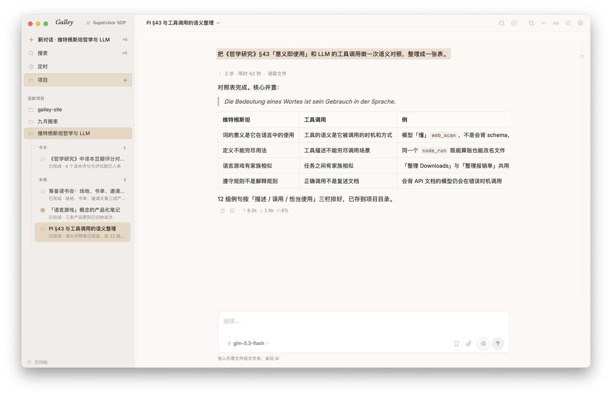
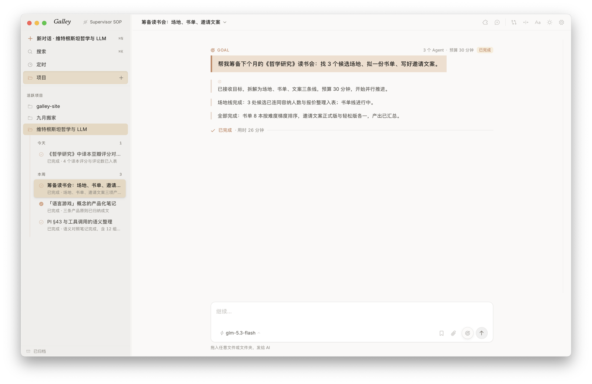
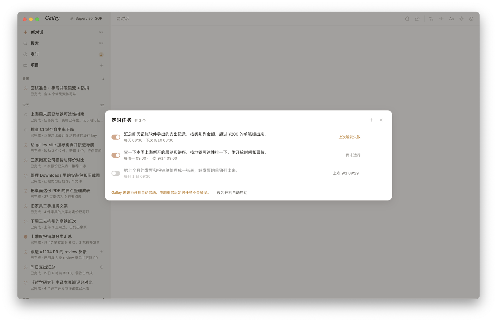
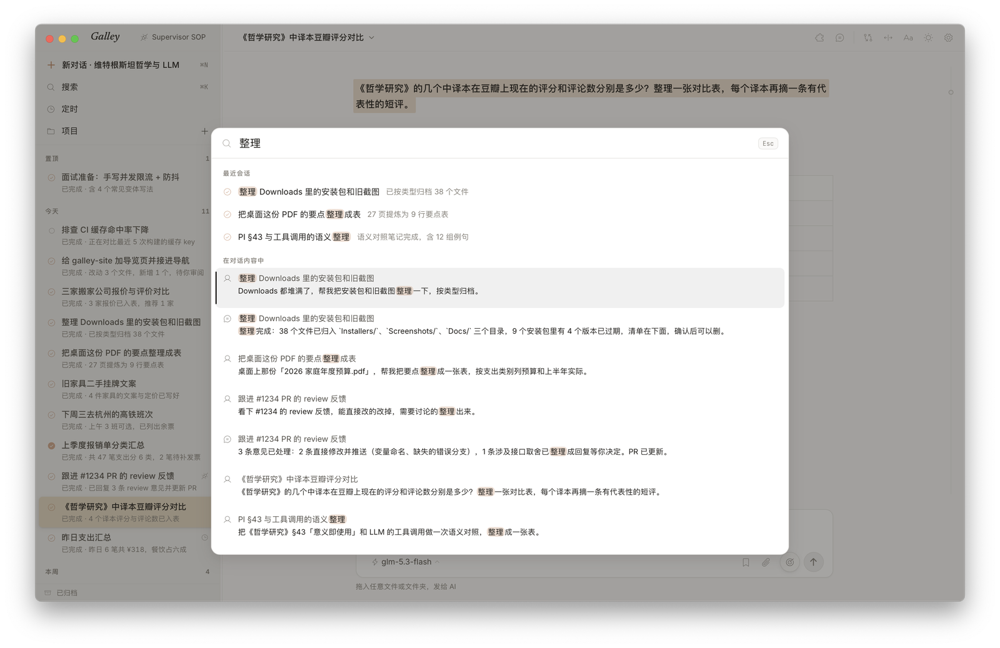
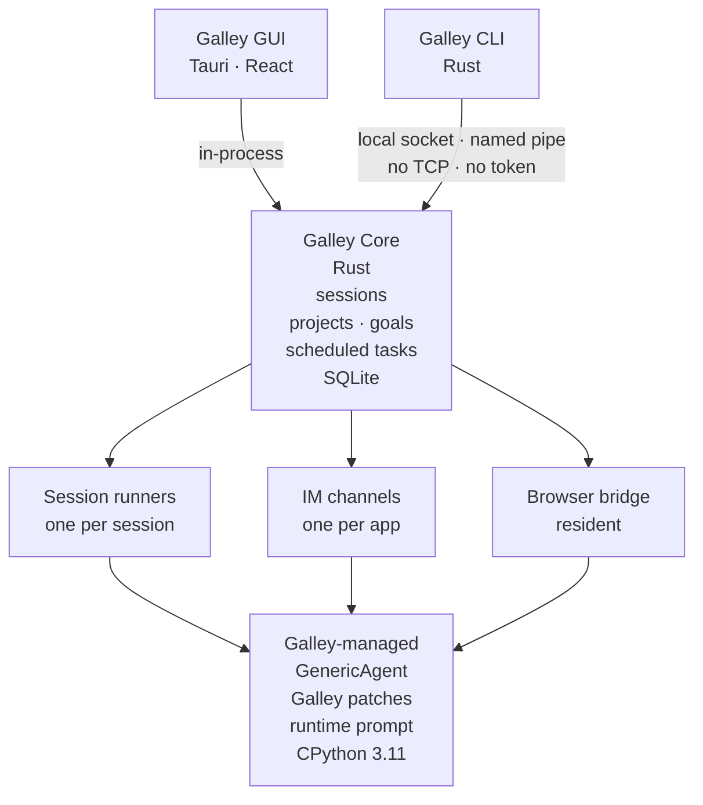
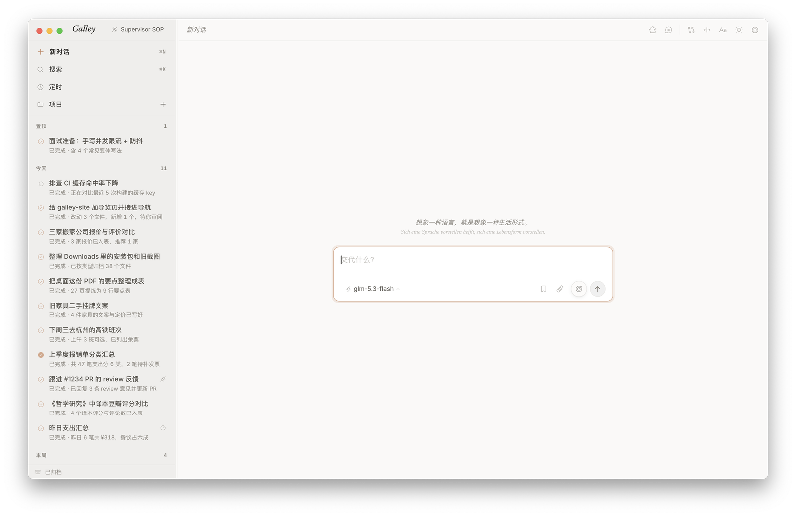

<p align="center">
  <picture>
    <source media="(prefers-color-scheme: dark)" srcset="docs/assets/readme-banner-dark.png">
    
  </picture>
</p>

<p align="center">
  跑在你电脑上的全能助手。极简 harness，把舞台留给模型，在模型飞速进化的时代押注未来。
</p>

<p align="center">
  <a href="https://github.com/wangjc683/galley/releases"><strong>下载</strong></a>
  ·
  <a href="#快速开始">快速开始</a>
  ·
  <a href="#截图">截图</a>
  ·
  <a href="./docs/README.md">文档</a>
  ·
  <a href="./README.md">English</a>
</p>

<p align="center">
  <a href="https://github.com/wangjc683/galley/releases"></a>
  <a href="https://github.com/wangjc683/galley/releases"></a>
  <a href="LICENSE"></a>
</p>

<p align="center">
  <picture>
    <source media="(prefers-color-scheme: dark)" srcset="docs/screenshots/zh/hero-dark.png">
    
  </picture>
  <br/>
  <sub>跟随系统外观，浅色深色各一套。</sub>
</p>

## Galley 是什么

Galley 是一个跑在你自己电脑上的个人 AI 助手，能真正做事——操作浏览器、终端和文件，甚至手机。它的 harness 刻意做薄：内核只保留最小工具集，把上下文保持在高密度，把舞台留给模型；模型每升级一次，Galley 就跟着强一次，不用等我们追。

一个助手不够用时，Galley 就是一支团队。多条会话并行推进，随时切换、接管、继续。你在 GUI 里看进度、发指令；Supervisor Agent 在 CLI 里编排同一支团队——两个角色，一份状态，所有数据都留在本地。

## 亮点

### 单个 agent，能干活

由内置内核驱动——基于 [GenericAgent](https://github.com/lsdefine/GenericAgent) 二次开发，随安装包附带，下载即用。

- 🖥️ **系统级执行**——终端、文件、键盘鼠标、屏幕视觉，直到通过 ADB 操作手机：从查资料到把事真正办完。
- 🌐 **真实浏览器**——把自带的扩展装进 Chrome 或 Edge 解锁一次，agent 用的就是你已登录的那个浏览器，不必重新登录。
- 🧬 **自进化技能**——每解决一个新任务，就把做法沉淀成可复用的技能；技能树长在你本地。
- 💰 **Token 效率，有数据**——靠信息密度而不是窗口长度：Lifelong AgentBench 上 100% 准确率，输入 token 只有主流 Agent 的 1/3 到 1/6（[论文](https://arxiv.org/abs/2604.17091)）；默认窗口 90K。
- 🔌 **任意模型，包括本地的**——从 Anthropic、OpenAI 到 DeepSeek、Kimi、GLM 的预设，ChatGPT 账号登录，任意兼容端点，Ollama 不用填 Key；推理强度按对话设定。
- 📖 **阅读面板**——agent 写出的文件在对话旁边打开：Markdown、代码、图片，CSV 显示成表格。在输入框添加文件或图片；只读审阅 Git 仓库的改动，统一或分栏。

### 一支团队，管得住

Galley 的编排层。你在 GUI 操作，Supervisor Agent 走稳定的 `galley` CLI；两边都是一等操作者，共享同一份会话与历史，不是各开各的。

- 🧭 **项目 + 并行会话**——把项目指向一个文件夹，代码仓库或资料夹都行，多条会话围绕它并行推进。
- 🎯 **Galley Goal**——给对话一个目标，它便自己一轮接一轮推进，直到模型宣告完成、到了时间上限，或你叫停。
- 🔧 **透明运行**——思考过程实时可见；每一步都能展开看完整参数与结果，跑完整轮折叠成一行。
- ⏰ **定时任务**——每天、每周或每月到点开一条新会话跑一段提示词，结果在侧栏等你；需要 Galley 处于运行中，可设为开机自动启动。
- 💬 **聊天软件**——微信、飞书、Telegram 或 Discord：在手机上找的就是同一个助手，长任务交给桌面端的会话。
- 💾 **后台常驻 + 搜索**——关窗不退出，Galley 留在菜单栏 / 托盘，做完时发通知；⌘K（Windows 上是 Ctrl+K）全文搜索历史会话。

## 截图

<table>
  <tr>
    <td width="50%" valign="top"><br/><sub>工具时间线 · 每次调用的参数、结果、耗时都在行内</sub></td>
    <td width="50%" valign="top"><br/><sub>阅读面板 · 在对话旁边审阅工作区改动</sub></td>
  </tr>
  <tr>
    <td width="50%" valign="top"><br/><sub>项目视图 · 多条会话围绕同一项目并行</sub></td>
    <td width="50%" valign="top"><br/><sub>Goal · 长期目标带章节标记地推进</sub></td>
  </tr>
  <tr>
    <td width="50%" valign="top"><br/><sub>定时任务 · 每天早上自己跑的一段提示词</sub></td>
    <td width="50%" valign="top"><br/><sub>⌘K · 历史会话全文可搜，直达命中的那一行</sub></td>
  </tr>
</table>

## 快速开始

先想好怎么接模型。ChatGPT / Codex、OpenAI、Anthropic、DeepSeek、Kimi for Coding、MiniMax、OpenRouter、SiliconFlow、Xiaomi MiMo、Zhipu GLM 预设开箱可选，端点已预填：ChatGPT / Codex 登录 ChatGPT 账号即可，其余填 API Key。其他 OpenAI 或 Anthropic 兼容端点选「自定义」，填上地址即可；Ollama 这类本地服务不用填 Key。

1. **下载 Galley**——从 [Releases](https://github.com/wangjc683/galley/releases) 下载 macOS / Windows 安装包。
2. **配置模型**——首次启动选择服务商、粘贴 API Key（或登录 ChatGPT），连接自动测试。
3. **开始使用**——点击「开始使用 Galley」，进入主对话界面（登录 ChatGPT 的会直接进入）。

| 平台 | 安装包 |
|---|---|
| macOS Apple Silicon | 文件名包含 `macOS_aarch64.dmg` |
| macOS Intel | 文件名包含 `macOS_x64.dmg` |
| Windows x64 | 文件名包含 `Windows_x64-setup.exe` |

<details>
<summary>安装提示</summary>

macOS 暂未代码签名，首次打开若被系统拦截，运行：

```bash
xattr -dr com.apple.quarantine /Applications/Galley.app
```

Windows SmartScreen 提示「发布者未知」时，点「更多信息」→「仍要运行」。

已有 [GenericAgent](https://github.com/lsdefine/GenericAgent) 环境，可在 **设置 → 运行环境 → 更多 → 接入外部 GA** 选择 GA 目录。接入后 Galley 严格只读，不改动外部 GA 的代码、memory、SOP 或 `mykey.py`。浏览器控制与聊天软件只在内置内核下可用，**设置 → 模型** 里的服务商也只供内置内核使用；外部 GA 继续用它自己的 `mykey.py`。

</details>

## Supervisor 与聊天软件

GUI 启动后进 **设置 → 智能体接入**：

| 按钮 | 做什么 |
|---|---|
| **复制 SOP** | 复制短版 [`galley-supervisor-sop.md`](./docs/integrations/galley-supervisor-sop.md) 发给你的 Agent，让它学会检查、继续、新开、拆分和等待 Galley 任务；高级细节见 [Supervisor reference](./docs/integrations/galley-supervisor-reference.md) |
| **查看 Agent API 文档** | 在「高级选项」里：打开完整命令清单、JSON schema 和 exit code |
| **安装 galley 命令** | 在「高级选项」里（macOS）：把 `galley` 放进 PATH，你和你的脚本都能在终端直接调用；SOP 不依赖它 |

你不用学 CLI——用自然语言告诉 Supervisor Agent 想做什么，由它来安排 Galley。复制给 Agent 的 SOP 是轻量热路径，高级命令和编排细节留在 reference 与 Agent API 里。用 Claude Code 的话，同一份 SOP 也可以装成 skill：[galley-supervisor](./.claude/skills/galley-supervisor/README.md)（Codex 版在 `.agents/skills/` 下）。

任务的大小对应不同的承载方式，而不是堆成一个巨型 prompt：

- **简单问题**——直接读或跟进某个 session；
- **项目 / 资料夹任务**——用 Project Workspace 绑定工作区，多会话并行；
- **长期目标**——你明确要的时候，给一个 session 开 Goal、定好时间上限，让它自己推进到完成。

也可以在 **设置 → 聊天软件** 接入微信 / 飞书 / Telegram / Discord，在手机上找到同一个助手；长任务它会交给桌面端的会话。

<details>
<summary>展开 CLI 示例</summary>

Galley 运行时，Supervisor Agent 可以在同一台机器上调用 `galley` 派任务：

```bash
# 看现在跑啥（每行的 `live.busy` 才是真实的忙闲信号；
# `live.askPending` 表示该 session 正等着用户回答问题）
galley status
galley sessions list

# 开个新 session 跟进 PR
galley session new --project=proj_work \
  --supervisor=ga-claude-1 --reason="跟进 PR review" \
  "看下 #1234 的反馈"

# 复杂任务：用一个 Project 承载一组 sessions
galley project create "Release readiness review" \
  --supervisor=ga-claude-1 --reason="并行检查发布风险"

galley session new "只读检查 app identity、数据目录、SQLite migration 和备份风险。输出风险清单和证据。" \
  --project=<project-id> --supervisor=ga-claude-1 --reason="检查数据安全"

galley session new "只读检查 packaging、release workflow、bundled resources 和版本号。输出 release blocker checklist。" \
  --project=<project-id> --supervisor=ga-claude-1 --reason="检查发布打包"

galley project follow <project-id> --tail=80 --until-idle --final-show

# 长目标（用户明确要求时才开）：session 自己一直推进，
# 直到模型宣告完成、到时间上限，或被叫停
galley goal start <session-id> "发布下一个 patch 版本" --budget-minutes=60 \
  --supervisor=ga-claude-1 --reason="用户要求一直做到完成"

galley goal status <goal-id>
galley goal extend <goal-id> --minutes=30
galley goal stop <goal-id>

# 跟进一个 session，或等它这一轮跑完
galley session follow <id>
galley session wait <id> --until-idle --timeout=600

# 切 LLM / 归档 / 恢复
galley llm set <id> "另一个模型名"
galley session archive <id> --supervisor=ga-claude-1 --reason="done"
galley session restore <id>
```

写命令接受 `--supervisor` 与 `--reason`；带上 `--supervisor` 就记为 `via=supervisor`，否则是 `via=cli`。Supervisor 创建的 session 和发出的消息，在侧栏和时间线上都带一个 Supervisor 标记，human 一眼就能看出哪些出自 agent。

完整命令清单、JSON schema 与 exit code 见 [Agent API 文档](./docs/agent-api/README.md)。

</details>

## 架构

GUI 和 CLI 是**对等前端**——不是 GUI 套壳 CLI，而是两端各自直连同一个 **Rust Core**：GUI 在应用内部直连，CLI 走本地 socket。Core 是唯一权威层，掌管 session / Project / Goal 状态、Goal 循环、定时任务、SQLite 写入，以及 Galley 运行的每一个 Python 进程；默认都跑在内置内核上，开箱即用。



三类进程都是 Python。接入外部 GA 时，会话 runner 改用外部 GA，聊天软件与浏览器桥不启动。

**技术栈：** Tauri v2 + React 19 + TypeScript 5.8 + Tailwind v4 / Rust（Galley Core + Galley CLI）/ Python（runner，包装 GenericAgent）/ SQLite + FTS5 trigram

更多文档入口：
[架构说明](./docs/architecture.md) ·
[贡献指南](./CONTRIBUTING.md) ·
[文档索引](./docs/README.md)

## 工程笔记

一些不在功能列表里、却决定了 Galley 工程质量的设计选择：

<details>
<summary>展开六条设计选择</summary>

- **对等前端，不是 GUI 套壳 CLI。** GUI 和 CLI 各自直连 Rust Core，互不依赖。关掉窗口，Core、正在跑的 session 和 CLI 都照常在后台工作。聊天软件也没有另起一套协议：每个 IM 渠道里的助手，用的就是 Supervisor 用的那套 CLI 来调度 Galley。

- **Rust Core 是唯一权威。** session / Project / Goal 的状态机、Goal 循环、定时任务、SQLite 写入和所有子进程全部收敛到 Core 一处。前端只读投影、发意图，不持有可写状态，从根上避免了多端状态漂移。

- **本地优先的安全模型。** 进程间走 Unix socket（`0600` 权限）或 Windows named pipe，仅 localhost、no token、no TLS——因为信任边界就是「同一台机器的同一个用户」。不把本地工具硬塞进一套网络鉴权，是有意识的减法。

- **Agent API 是有版本的公开契约。** CLI 输出带 `schemaVersion`；同一版本内只做增量，破坏性改动必须升版本——`2` 随 Goal v2 在 v0.5.0 引入，没改过的命令仍回答 `1`。写命令会记下谁让做的、为什么（`via` / `supervisor` / `reason`）。Supervisor 可以放心把它当 API 来编程。

- **双 runtime 的边界纪律。** 默认用内置内核（含 CPython 3.11 与依赖，开箱即用）；接入外部 GenericAgent 时，Galley 严格只读——不改外部 GA 的代码、memory、SOP 或 `mykey.py`，你的现有环境不会被污染。

- **可演进的持久层。** SQLite 作权威存储；升级前先整份备份数据目录，再按序跑 migration。历史会话用 FTS5 trigram 索引，中文也能子串搜索，关窗后台常驻、回来即搜。

</details>

## 为什么叫 Galley

船上的 galley 是厨房，也是工作台。每个人来这里都有自己的事，**但桌子是同一张**。

Galley 也是这张桌子：human 在 GUI 推进工作，Supervisor Agent 通过 CLI 管理 agent team。两边共享同一份 session、历史和决策日志，不是各开各的 tab。

> *Galley started as a workbench for [GenericAgent](https://github.com/lsdefine/GenericAgent). The first two letters of our name are a quiet bow to where we came from.*

<p align="center">
  
  <br/>
  <sub>每次新对话都从一句题词开始，这句出自《哲学研究》。</sub>
</p>

## 贡献 / 从源码构建

```bash
git clone https://github.com/wangjc683/galley
cd galley
pnpm --dir gui install
./scripts/bundle-python.sh mac-arm64   # 或 mac-x64 / win-x64：一次性备好内置 Python
pnpm --dir gui tauri dev               # 桌面开发模式
```

环境要求、CI 跑的检查、runner 测试、安装包与独立 CLI 的构建，见 [CONTRIBUTING.md](./CONTRIBUTING.md)。

## 致谢

Galley 的内核基于 [**lsdefine/GenericAgent**](https://github.com/lsdefine/GenericAgent) 二次开发——约 3K 行种子代码、自进化的极简 agent 框架。没有这份干净的地基，就没有 Galley。

相关论文：[GenericAgent: A Token-Efficient Self-Evolving LLM Agent via Contextual Information Density Maximization (arXiv:2604.17091)](https://arxiv.org/abs/2604.17091)

## 许可证

[MIT](./LICENSE)
